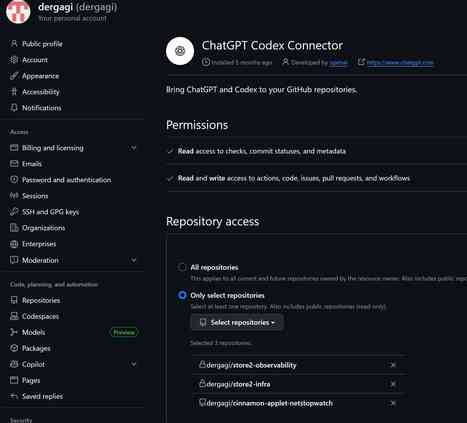
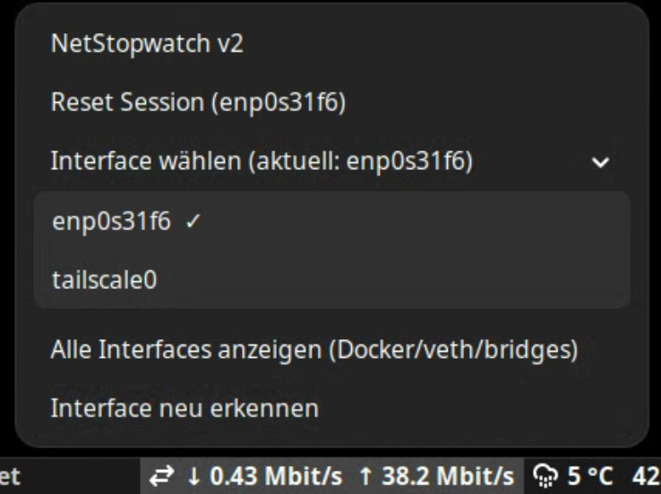

# Net Traffic Stopwatch Applet

Net Traffic Stopwatch ist ein Cinnamon‑Applet, das zeigt, wie viel Netzwerkverkehr (empfangen/gesendet) du seit deiner Anmeldung verbraucht hast. Es verhält sich wie eine Stoppuhr für deinen Datenverkehr und lässt sich per Menü zurücksetzen.

## Why it’s different

Im Gegensatz zu vielen Bandbreiten‑Monitoren misst dieses Applet session‑basiert: Die Zähler starten bei jedem Login neu und können jederzeit per Klick zurückgesetzt werden. Zudem kannst du die zu überwachende Netzwerkschnittstelle auswählen und bei Bedarf Docker/veth‑Interfaces ausblenden.

## Install

1. Repository klonen oder herunterladen.
2. Den Applet‑Ordner in dein Cinnamon‑Applet‑Verzeichnis kopieren:

        mkdir -p ~/.local/share/cinnamon/applets
        cp -a netstopwatch@store2 ~/.local/share/cinnamon/applets/

3. Cinnamon neu starten (Alt + F2, dann r) oder ab-/anmelden.
4. Über „Add applets to panel“ das Applet in ein Panel einfügen.

Eine Einreichung bei Cinnamon Spices ist geplant.

## Compatibility

Getestet mit Cinnamon 5.x/6.x auf Linux Mint 21 und Debian 12/13. Läuft überall, wo Cinnamon und `/sys/class/net/*/statistics/` verfügbar sind.

## Privacy & Security

Das Applet schnüffelt nicht im Netzwerkverkehr und öffnet keine Sockets. Es liest ausschließlich die RX/TX‑Bytezähler aus `/sys/class/net/<iface>/statistics/{rx,tx}_bytes` und berechnet daraus die Anzeige.

## Screenshots

Speichere deine Screenshots unter `assets/screenshots/` und verweise sie hier, z. B.:

## Issues & contributions

Fehler oder Feature‑Vorschläge bitte über GitHub Issues melden. Pull Requests sind willkommen.

## License

Lizenz: MIT – siehe [LICENSE](LICENSE) für Details.
